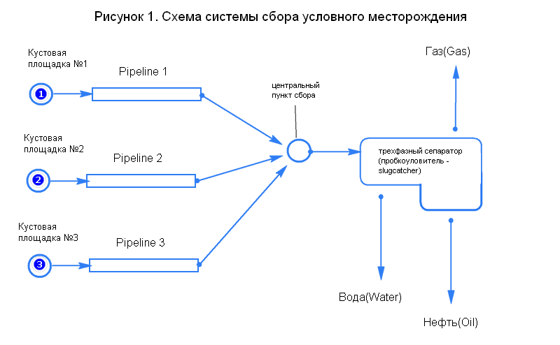
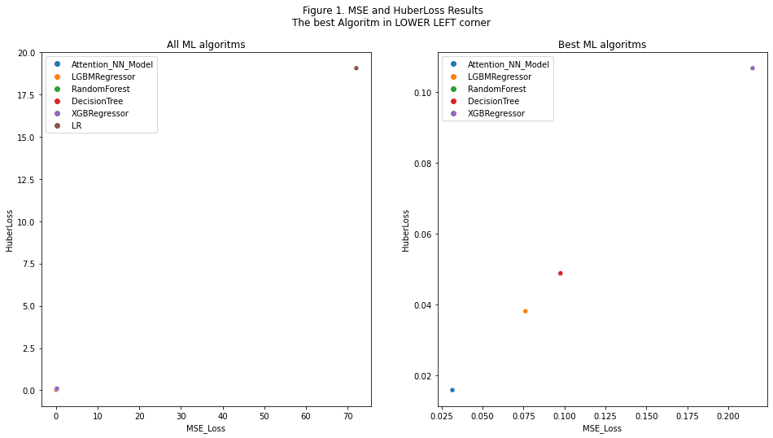

Дипломная Работа
--

### Тема: Построение модели прогнозирования состояния трефазного сепаратора (пробкоуловителя) для оптимизации выхода полезного продукта

#### Задача на производстенном языке: 

В течении срока работы месторождения выход скважинного продукта меняется. Так же скважинный продукт может различаться в более короткий период, например в результате сноса газовой пробки из скважины или на линейном участке трубопровода системы сбора. 
В результате резкой смены скважинного продукта входные трехфазные сепараторы, установленные на центральном пункте сбора (пробкоуловители см.__Рис.1__) могут не справиться с резким увеличением компонентов входного продукта. Чем вызовет переполнения входного трехфазного сепаратора, газовые линии которого, не предполагающие наличие жидкого компонента, могут быть заблокированы, пропускная способность всего дальнейшего цикла подготовки снижена, а также вышестоящее по газовому потоку оборудование может быть деградировано. 

#### Формализованная форма задачи

Составить прогнозную модель уровня жидкости входного трехфазного сепаратора, в зависимости от определенных паттернов в изменяющихся входных данных.
__ Формализованная задача__: Составить математическую модель предсказания, в зависимости от изменяющихся входных данных – признаков.

За исходные данные принята модель сбора условного месторождения (__Рисунок 1__). Условное месторождение состоит из 3 кустовых площадок, центральным пунктом сбора,  из центрального пункта сбора скважинный продукт поступает на подготовку: очистку, переработку, транспортировку (на схеме не показано).

#### Метрики  :
Поскольку задача является задачей регрессии, то метрики качества модели приняты MSE (Mean Squared Error) и Функция потерь Хьюбера (при delta=1 является SmoothL1 Loss):

l_n = \begin{cases}
0.5 (x_n - y_n)^2, & \text{if } |x_n - y_n| < delta \\
delta * (|x_n - y_n| - 0.5 * delta), & \text{otherwise }
\end{cases}

#### Использованные модели классического ML:
- Decision Tree Regressor, 
- RandomForestRegressor, 
- XGBRegressor, 
- LGBMRegressor

#### Модель NN:

Структура сети будет построена на __Attention__. То есть модель должна сама понимать откуда пришел объем жидкости. 
Исходными данными для итоговой модели вытянутые в строку значения lag_j:
lag_{ij}=P_i-P_{ i shift j}
, где P_i - это давление в момент времени i
P_{ i shift j} - это отступ от давления в момент времени i на j шагов

1. Все lag_{ij} создаются для каждого трубопровода и конкатенируются горизонтально. Сами же абсолютные значения давлений в таблице удалены
1. Далее идет блок attention, суть которого определить на какую строку обращать внимание
1. Полученный softmax (attention) умножается на исходные lagij 
1. Далее LSTM(2-directional)
1. Вытягивание в один вектор (Flatten)
1. Два полносвязанных слоя на выходе последнего 1 нейрон c активацией – linear 

__Рисунок 2__ Сравнительная диаграмма разных алгоритмов  

